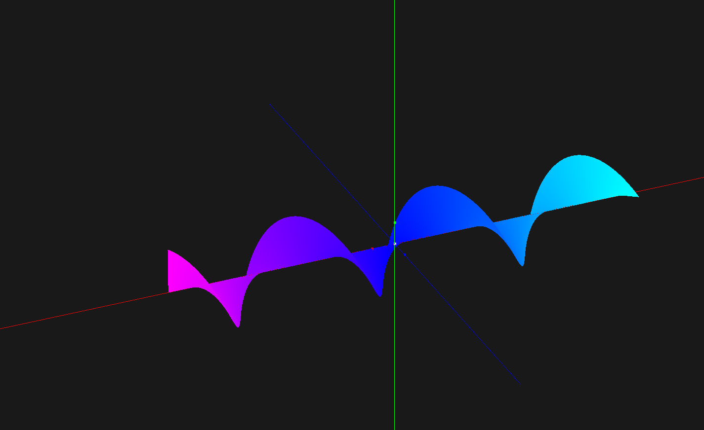

# Test project
### Небольшой проект на lwjgl, планируемый как игра
Несложный проект, задумываемый как поле для эксперементов, изучения новых технологий.
Планирую освоить рендер OpenGL и многопоточность, так же попрактиковаться с аннотациями, углубиться в ООП, поиграть с настройками компилятора, а так же созданием процессоров аннотаций и попробовать работать с ObjectWeb ASM.

#### Сейчас есть это) 
